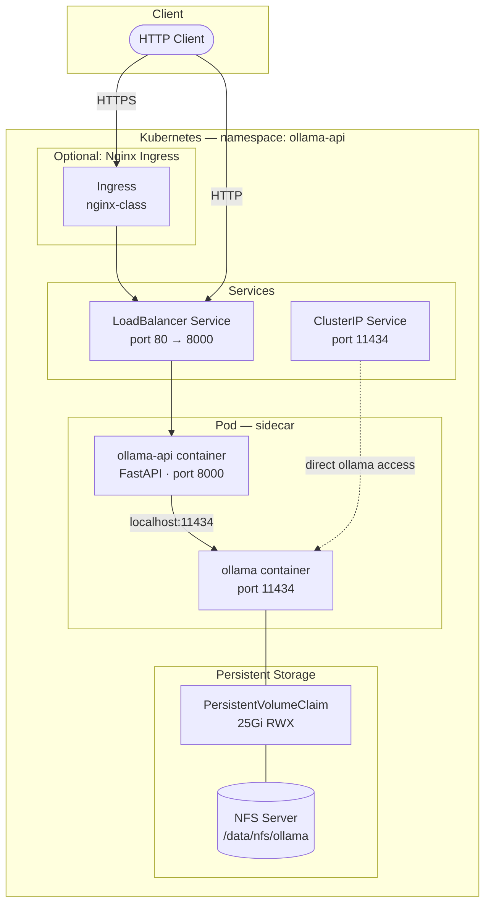

# ollama-api

A lightweight FastAPI gateway that exposes a clean REST API over a self-hosted [Ollama](https://ollama.com) LLM runtime. Runs locally via Docker Compose or on Kubernetes via the included Helm chart.

## Architecture

Both `ollama` and `ollama-api` run as sidecar containers inside the **same pod**. The API gateway reaches Ollama over `localhost:11434`, eliminating an inter-pod network hop. A single Deployment controls replica count for both.



### Local (Docker Compose)

```
HTTP Client → ollama-api :8001 → ollama :11434 → ./ollama_data (bind mount)
```

### CI/CD

```
git push main → GitHub Actions (ARC runner)
                  ├─ docker build + push → Docker Hub  (:7-char SHA tag)
                  └─ helm upgrade --install → Kubernetes cluster
                       ├─ kubectl rollout status (timeout 20m, rollback on failure)
                       └─ curl smoke test → /health
```

## API Endpoints

| Method | Path | Description |
|--------|------|-------------|
| `GET` | `/health` | Liveness check — verifies Ollama is reachable |
| `GET` | `/version` | Ollama version passthrough |
| `GET` | `/models` | List all pulled models |
| `GET` | `/models/{name}` | Get model details |
| `DELETE` | `/models/{name}` | Delete a model |
| `POST` | `/generate` | Text generation (streaming supported) |
| `POST` | `/chat` | Chat completion (streaming supported) |
| `POST` | `/embeddings` | Generate embeddings |
| `POST` | `/pull` | Pull a model from the Ollama registry |

Interactive docs available at `/docs` (Swagger UI) and `/redoc`.

## Quick Start — Docker Compose

```bash
# Start Ollama + API gateway
docker compose up -d

# Pull a model
curl -X POST http://localhost:8001/pull \
  -H 'Content-Type: application/json' \
  -d '{"model": "llama3.2"}'

# Generate text
curl -X POST http://localhost:8001/generate \
  -H 'Content-Type: application/json' \
  -d '{"model": "llama3.2", "prompt": "Why is the sky blue?"}'

# Chat
curl -X POST http://localhost:8001/chat \
  -H 'Content-Type: application/json' \
  -d '{
    "model": "llama3.2",
    "messages": [{"role": "user", "content": "Hello!"}]
  }'
```

## Kubernetes — Helm

### Prerequisites

- Kubernetes cluster with `kubectl` access
- Helm 3
- An NFS share (or update `values.yaml` to use a different storage class)

### Install

```bash
helm upgrade --install ollama-api ./helm/ollama-api \
  --namespace ollama-api \
  --create-namespace \
  --set ollamaApi.image.repository=<your-registry>/ollama-api \
  --set ollamaApi.image.tag=latest
```

### Key `values.yaml` Options

| Key | Default | Description |
|-----|---------|-------------|
| `ollama.replicaCount` | `1` | Number of pods (each runs both `ollama` and `ollama-api` as sidecars) |
| `ollama.resources.limits` | 7Gi / 3 CPU | Resource ceiling for the `ollama` container |
| `ollama.progressDeadlineSeconds` | `900` | Seconds K8s waits for a deploy to progress before marking it Failed; extended to allow for large image pulls |
| `ollama.persistence.size` | `25Gi` | PVC size for model storage |
| `ollama.persistence.nfsServer` | `10.0.0.40` | NFS server IP |
| `ollama.persistence.nfsPath` | `/data/nfs/ollama` | NFS export path |
| `ollama.gpu.enabled` | `false` | Enable GPU scheduling |
| `ollama.gpu.runtimeClassName` | `nvidia` | Container runtime class used when `gpu.enabled` is true |
| `ollamaApi.resources.limits` | 512Mi / 500m CPU | Resource ceiling for the `ollama-api` sidecar container |
| `ollamaApi.service.loadBalancerIP` | `10.0.0.243` | Static LB IP (bare-metal); routes port 80 → container port 8000 |
| `ingress.enabled` | `false` | Enable Nginx ingress |
| `ingress.className` | `nginx` | IngressClass name — sets both `spec.ingressClassName` and the `kubernetes.io/ingress.class` annotation for compatibility with older controllers |
| `ingress.host` | `""` | Hostname to match (e.g. `ollama-api.example.com`); omit for catch-all |
| `ingress.path` | `/` | Path prefix to match |

### GPU Support

```yaml
# values.yaml
ollama:
  gpu:
    enabled: true
    count: 1
    runtimeClassName: nvidia
```

### HPA (autoscaling)

`ollama.hpa` supports `enabled`, `minReplicas`, `maxReplicas`, and CPU/memory targets. Because both containers run as sidecars in the same pod, scaling the Deployment scales both together.

## Local Development

```bash
# Install dependencies
pip install -r requirements.txt

# Run with a local Ollama instance
OLLAMA_BASE_URL=http://localhost:11434 uvicorn app.main:app --reload
```

## Stack

| Component | Technology |
|-----------|-----------|
| API Gateway | Python 3.12 · FastAPI · uvicorn · httpx |
| LLM Runtime | Ollama |
| Container | Docker (python:3.12-slim) |
| Orchestration | Kubernetes + Helm |
| CI/CD | GitHub Actions + Actions Runner Controller |
| Image Registry | Docker Hub |
